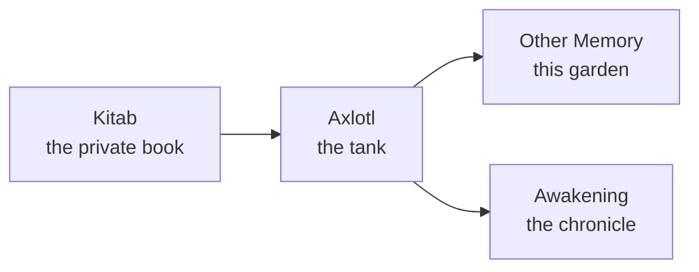

Every page here started as a note in a private notebook that will never be published. Between that notebook and this page sits a pipeline whose whole job is to make sure only the *story* crosses over, never the floor plan.

- **Kitab** is the private notebook: journals, findings, the running narrative, written by the engineers in the moment.
- **Axlotl** is the tank. In the novels it grows a *reconstruction* from the cells of the dead, not a copy. Here it is the sanitization step — a rewrite from altitude, then an automated gate that refuses to pass anything that looks like an address, a real hostname or a credential, then a human who reads the result.
- **Other Memory** is what you are reading: the associative, no-required-order side. Its sibling, **Awakening**, is the same material told as a chronicle.

> [!TIP]
> **Why two sites from one source**
>
> The expensive part of publishing safely is the pipeline, not the rendering. Once the sanitized markdown exists, pointing two generators at it costs almost nothing — and they serve genuinely different ways of reading.

> [!WARNING]
> **What the gate cannot catch**
>
> The gate matches *strings*. A paragraph can leak an architecture with every literal identifier already removed. That is why there is a human in the loop, and why [the forgetting problem](./what-forgetting-costs.md) is treated as a design constraint rather than an inconvenience.
